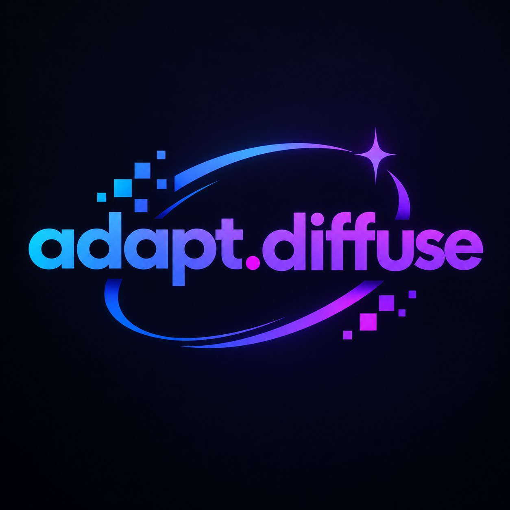

<p align="center">
  
</p>

# AdaptDiffuse

**Plug-and-play Stable Diffusion engine** with automatic GPU backend cascade and a clean WebUI.

**▶ Try it online:** [huggingface.co/spaces/PedAI/Adapt-Diffuse](https://huggingface.co/spaces/PedAI/Adapt-Diffuse) — SD 1.5 demo running on free HF ZeroGPU hardware, no install needed.

Primary engine is **sd-cli** ([stable-diffusion.cpp](https://github.com/leejet/stable-diffusion.cpp)) —
one small native binary, no torch needed:

```
NVIDIA (CUDA)  →  AMD/Intel (Vulkan)  →  DirectML (very old)  →  CPU
                     └── all sd-cli builds · ROCm(HIP) available as an explicit option
```

## Gallery

Generated locally with AdaptDiffuse (SD 1.5 · Q5_1 GGUF):

| | | |
|---|---|---|
|  |  |  |

## Why Adapt-Diffuse

- **Runs on almost any GPU** — CUDA / Vulkan / DirectML / CPU picked automatically.
  You never need to know what a "backend" is; ROCm is one dropdown away when you want it.
- **No PyTorch by default** — one small native `sd-cli` binary instead of a multi-GB torch stack.
- **Built for weak GPUs** — VAE tiling, attention slicing, CPU offload, GGUF quantization,
  FP16 gated only on hardware known to be safe.
- **Setup in one double-click** — `launch.bat` creates the venv, detects your hardware and opens the UI;
  the first run downloads only what it actually needs.
- **Private by design** — prompts and images never leave your machine. No telemetry, no accounts.
- **A front-end, not a fork** — a lightweight local inference UI + backend orchestrator
  instead of a 5 GB plugin ecosystem.

## Downloads & verification

Every remote artifact is checked before it can be executed or loaded:

| What | Source | Verified with |
|---|---|---|
| sd-cli binaries | [leejet/stable-diffusion.cpp](https://github.com/leejet/stable-diffusion.cpp) releases | exact byte count + published `sha256` digest (mismatch = rejected) |
| Vulkan SDK | sdk.lunarg.com | silent install, then `vulkan-1.dll` presence is re-checked |
| Models (CivitAI) | CivitAI API | SHA-256 from the API when published; mismatch → saved as `*.corrupt`, never loaded |
| Models (Hugging Face) | `huggingface_hub` | LFS hash verification performed by the hub client |

Archives are extracted with **path-traversal (Zip Slip) protection**, and partial downloads land in
`*.part` files that are renamed into place only after verification.

## Troubleshooting

Failures are no longer silent: open **Diagnóstico** in the WebUI (or read `logs/backend.log`)
to see the exact step that failed, its exit code and the message behind it.

| Symptom | Likely cause | Fix |
|---|---|---|
| sd-cli download fails / 404 | release asset renamed, proxy or firewall | check *Diagnóstico* for the available asset names; drop the zip manually into `bin/`, or switch **Backend preference** → `cpu` |
| Vulkan still missing after install | installer blocked, GPU driver without Vulkan | install your GPU driver first, restart, then *Redisetect hardware* |
| `pip install` errors in the log | offline or corporate package index | run `.venv\Scripts\python -m app.main --setup` manually with your own index |
| CivitAI download 401 / 403 | age-restricted model | set `CIVITAI_API_KEY` (see above) |
| A file ends up as `*.corrupt` | SHA-256 did not match the published hash | delete it and download again — that file was not trustworthy |
| Out of memory while generating | model larger than VRAM | use a **GGUF** (Q5_1), 512px, or let `--max-vram` / offload do their job |
| Wrong backend selected | ambiguous hardware report | **Backend** tab → pick a preference → *Apply & reinstall deps* |

## Quick start (Windows)

1. Install [Python 3.10](https://www.python.org/downloads/release/python-3100/) (any 3.10.x; check *Add to PATH*).
2. Double-click **`launch.bat`** — it enumerates every installed Python (py launcher, PATH, registry, common dirs) and uses **3.10**.
3. First run creates a private `.venv`, detects your GPU, downloads the matching sd-cli
   build (+ Vulkan SDK only if the loader is missing), and opens **http://127.0.0.1:7860**.

That's it — no manual CUDA/ROCm/Vulkan setup for the default paths.

## Backend cascade

| Priority | Hardware | Engine | Notes |
|---|---|---|---|
| 1 | NVIDIA (CUDA) | **sd-cli CUDA build** | Falls back to the Vulkan build if download fails |
| 2 | AMD / Intel / any GPU with Vulkan | **sd-cli Vulkan build** | Auto-downloads binary; Vulkan SDK if loader missing |
| 3 | Forced `rocm` | **sd-cli ROCm(HIP) build** | `win-rocm` asset; needs a ROCm-capable GPU |
| 4 | Very old Windows GPU, no Vulkan | `torch-directml` (**torch 2.4.1** + **torch-directml 0.2.5.dev240914**) | Broad DX12 coverage; only torch path |
| 5 | Anything else | **sd-cli CPU build** | Always works |

**FP16 policy:** the torch/DirectML path only enables `float16` on known-safe GPU
generations. sd-cli is immune to this — ggml applies whatever quantization the model
file already has (prefer **GGUF** for weak GPUs).

**Weak-GPU guards (sd-cli):** VAE tiling always; `--max-vram` on ≤6 GB cards;
`--offload-to-cpu` when weights exceed ~85% of VRAM or the card has ≤2 GB.

## Default model

The sd-cli path defaults to a single **GGUF** file (~1.6 GB), downloaded on first use:

`second-state/stable-diffusion-v1-5-GGUF` → `stable-diffusion-v1-5-pruned-emaonly-Q5_1.gguf`

The DirectML/torch path defaults to `stable-diffusion-v1-5/stable-diffusion-v1-5` (diffusers layout).

## Features

- **WebUI (Gradio)** — prompt, advanced params, gallery, model manager, backend switcher
- **LoRA** — pick a file under `models/loras/` + scale; applied via sd-cli `<lora:name:scale>` syntax
- **Model downloader** — Hugging Face repos + CivitAI URLs/IDs/search (type `LORA` → `models/loras/`)
- **Local models** — scans `models/` for `.safetensors` / `.ckpt` / `.gguf`
- **Weak-GPU optimizations** — attention slicing, VAE slicing, DPM++ 2M Karras, conservative resolutions
- **No telemetry** — prompts and images stay on your machine

## CivitAI / HF tokens

Optional environment variables (never written to disk by AdaptDiffuse):

```bat
set HF_TOKEN=hf_...
set CIVITAI_API_KEY=...
```

Age-restricted CivitAI models require your own API key.

## Manual CLI

```bat
.venv\Scripts\python -m app.backend          # detect + save backend.json
.venv\Scripts\python -m app.main --setup     # install deps for backend
.venv\Scripts\python -m app.main --port 7860
.venv\Scripts\python -m app.main --backend vulkan
```

Backend choices: `auto` · `cuda` · `rocm` · `vulkan` · `directml` · `cpu`

## Project layout

```
adaptdiffuse/
├── launch.bat           # plug-and-play entry (venv + deps + WebUI)
├── requirements.txt
├── app/
│   ├── backend.py       # GPU detect + cascade + installers
│   ├── pipeline.py      # diffusers + stable-diffusion.cpp engines
│   ├── downloader.py    # HF / CivitAI (checkpoints, LoRAs)
│   ├── webui.py         # Gradio UI (incl. LoRA dropdown + scale)
│   └── main.py          # CLI entry
├── models/              # checkpoints/, loras/, vae (gitignored)
└── outputs/             # generations (gitignored)
```

## Support

Feedback and bug reports welcome:

- **Email:** [stableuser1223@gmail.com](mailto:stableuser1223@gmail.com?subject=AdaptDiffuse%20feedback)
- **GitHub:** [Feedback](https://github.com/jhfuheuiwfh/adaptdiffuse/issues/new?template=feedback.yml) · [Bug report](https://github.com/jhfuheuiwfh/adaptdiffuse/issues/new?template=bug_report.yml) · [All issues](https://github.com/jhfuheuiwfh/adaptdiffuse/issues)

The WebUI has a **Support** tab with the same contacts.

## Uninstall

Delete the project folder (includes `.venv`, `models/`, `outputs/`).

## License

MIT
